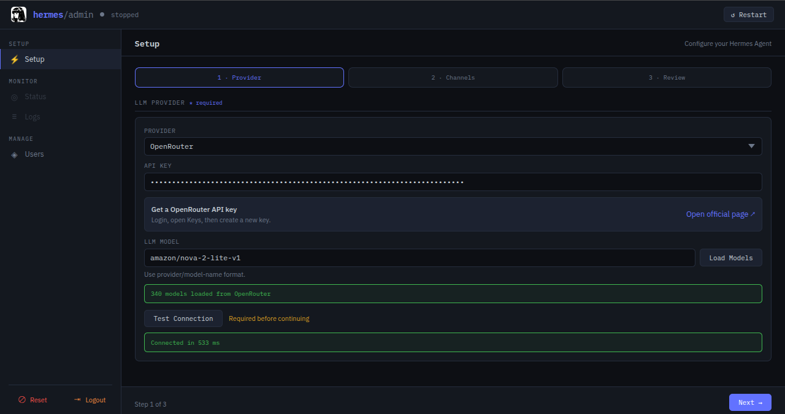
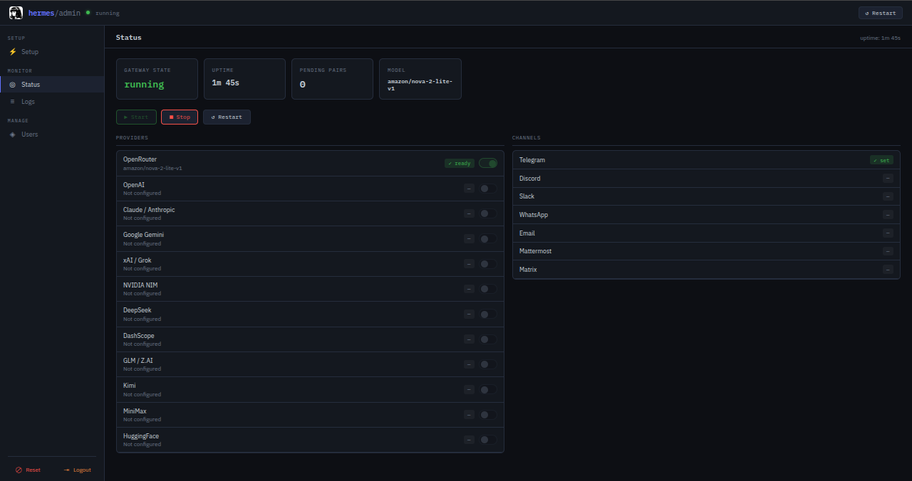
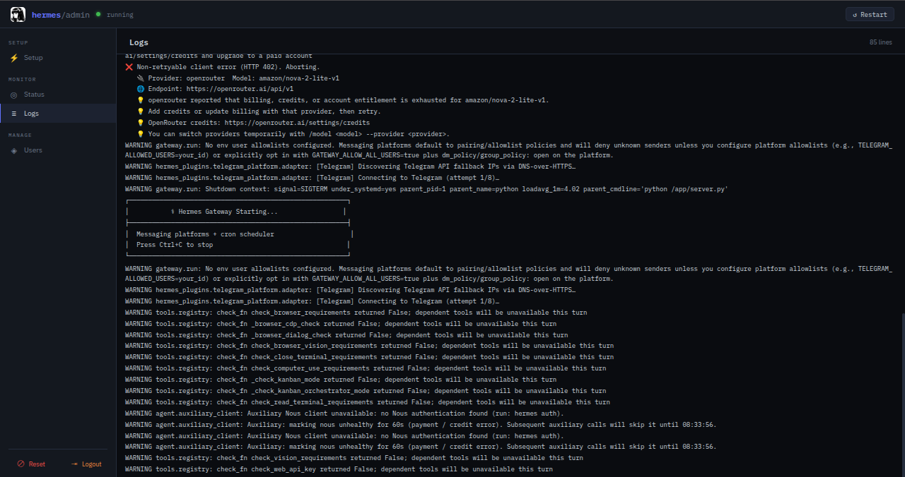

# Hermes Agent — Railway Template


Deploy [Hermes Agent](https://github.com/NousResearch/hermes-agent) on [Railway](https://railway.app) with a web-based admin dashboard for configuration, gateway management, and user pairing.

[](https://railway.com/deploy/hermes-agent-2?referralCode=asepsp&utm_medium=integration&utm_source=template&utm_campaign=generic)

> Hermes Agent is an autonomous AI agent by [Nous Research](https://nousresearch.com/) that lives on your server, connects to your messaging channels (Telegram, Discord, Slack, etc.), and gets more capable the longer it runs.

<!-- TODO: Add dashboard screenshot -->
<!--  -->

## Features

- **Admin Dashboard** — dark-themed UI to configure providers, channels, tools, and manage the gateway
- **One-Page Setup** — provider dropdown, checkbox-based channel/tool toggles — no config files to edit
- **Provider Model Picker** — verify an API key and load available models directly from the provider
- **Multi-Provider Switching** — store multiple provider keys and choose exactly one active provider from Status
- **Safe Integration Management** — add or remove providers and channels with active/last-item protection
- **Non-Destructive Config** — dashboard updates are merged into `config.yaml` without discarding unrelated Hermes settings
- **Gateway Management** — start, stop, restart the Hermes gateway from the browser
- **Live Status** — stat cards for gateway state, uptime, model, and pending pairing requests
- **Live Logs** — streaming gateway log viewer
- **User Pairing** — approve or deny users who message your bot, revoke access anytime
- **Admin Login** — session-based web login with secure logout; Basic Auth remains available for API clients
- **Reset Config** — one-click reset to start fresh

## Getting Started

The easiest way to get started:

### 1. Get an LLM Provider Key (free)

1. Register for free at [OpenRouter](https://openrouter.ai/)
2. Create an API key from your [OpenRouter dashboard](https://openrouter.ai/keys)
3. Pick a free model from the [model list sorted by price](https://openrouter.ai/models?order=pricing-low-to-high) (e.g. `google/gemma-3-1b-it:free`, `meta-llama/llama-3.1-8b-instruct:free`)

### 2. Set Up a Telegram Bot (fastest channel)

Hermes Agent interacts entirely through messaging channels — there is no chat UI like ChatGPT. Telegram is the quickest to set up:

1. Open Telegram and message [@BotFather](https://t.me/BotFather)
2. Send `/newbot`, follow the prompts, and copy the **Bot Token**
3. Keep the token ready — the bot will not respond until it is configured and
   the Hermes gateway is started in step 4.
4. To find your Telegram user ID, message [@userinfobot](https://t.me/userinfobot)

### 3. Deploy to Railway

1. Click the **Deploy on Railway** button above
2. Set the `ADMIN_USERNAME` and `ADMIN_PASSWORD` environment variables
3. Open your app URL — login with username `admin` and your password

### 4. Configure in the Admin Dashboard

1. **LLM Provider** — select OpenRouter from the dropdown, paste your API key, enter the model name
2. **Messaging Channel** — check Telegram, paste the Bot Token from BotFather
3. Click **Save & Start** — the gateway will start and your bot goes live
   
    

### 5. Check Status & Logs
- Status cards show gateway state, uptime, and model
  

- Logs panel streams gateway stdout/stderr for debugging and monitoring

  

### 5. Start Chatting

After **Save & Start** reports that the gateway is running, message your
Telegram bot. If you are not already allowed, a pairing request will appear
under **Users**:

1. Open **Users** in the Admin Dashboard.
2. Review the Telegram username and user ID.
3. Click **Approve**.


The **Users** page is always accessible, including before initial setup, but it
will remain empty until a configured messaging channel receives a pairing
request. If **Allow all users** is enabled, pairing approval is skipped.

<!-- TODO: Add Telegram chat screenshot -->
<!--  -->

## Environment Variables

| Variable         | Default    | Description         |
| ---------------- | ---------- | ------------------- |
| `PORT`           | `8080`     | Web server port     |
| `ADMIN_USERNAME` | `admin`    | Admin login username |
| `ADMIN_PASSWORD` | `changeme` | Admin login password |
| `ADMIN_SESSION_TTL` | `43200` | Web login lifetime in seconds |
| `ADMIN_SESSION_SECRET` | derived | Optional secret used to sign login sessions |

All other configuration (LLM provider, model, channels, tools) is managed through the admin dashboard.

## Supported Providers

OpenRouter, OpenAI, Claude / Anthropic, Google Gemini, xAI / Grok, NVIDIA NIM,
DeepSeek, DashScope, GLM / Z.AI, Kimi, MiniMax, Hugging Face

## Supported Channels

Telegram, Discord, Slack, WhatsApp, Email, Mattermost, Matrix

## Supported Tool Integrations

Parallel (search), Firecrawl (scraping), Tavily (search), FAL (image gen), Browserbase, GitHub, OpenAI Voice (Whisper/TTS), Honcho (memory)

## Architecture

```
Railway Container
├── Python Admin Server (Starlette + Uvicorn)
│   ├── /            — Admin dashboard (Login session)
│   ├── /login       — Session-based Admin Login
│   ├── /health      — Health check (no auth)
│   └── /api/*       — Config, status, logs, gateway, pairing
└── hermes gateway   — Managed as async subprocess
```

The admin server runs on `$PORT` and manages the Hermes gateway as a child
process. Browser access uses the Admin Login session; Basic Auth remains
available for API clients that send credentials explicitly. Config is stored in
`/data/.hermes/.env` and `/data/.hermes/config.yaml`. Gateway stdout/stderr is
captured into a ring buffer and streamed to the Logs panel.

## Running Locally

```bash
docker build -t hermes-agent .
docker run --rm -it -p 8080:8080 -e PORT=8080 -e ADMIN_PASSWORD=changeme -v hermes-data:/data hermes-agent
```

Open `http://localhost:8080` and login with `admin` / `changeme`.

## Credits

- [Hermes Agent](https://github.com/NousResearch/hermes-agent) by [Nous Research](https://nousresearch.com/)
- UI inspired by [OpenClaw](https://github.com/praveen-ks-2001/openclaw-railway) admin template
